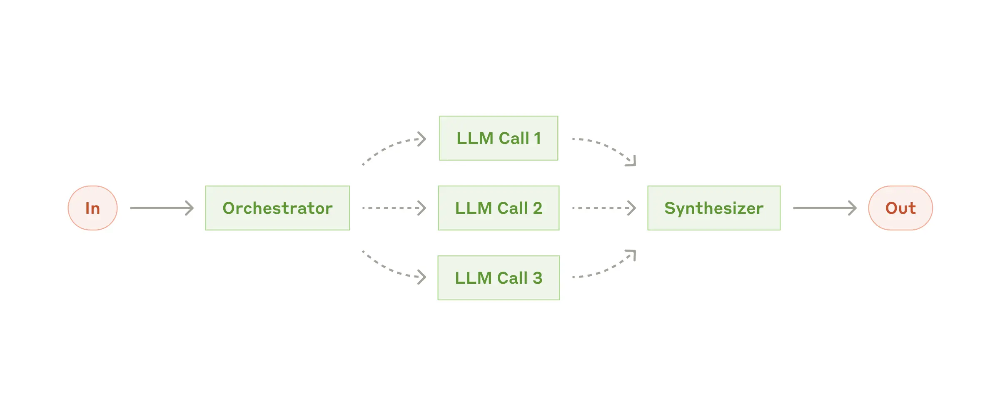

# Multi-Stage Code Generation System for Python Development

Detailed Component Descriptions
1. Task Router

Function: Initial entry point that categorizes incoming tasks and routes them to the appropriate orchestrator
Implementation: LLM-based classifier or rule-based router
Input: User query/task
Output: Categorized task with metadata for orchestration

2. Orchestrator System
a. Orchestrator LLM Call

Function: Analyzes the task and creates a high-level plan
Implementation: LLM prompt optimized for task decomposition and planning
Input: User task and context
Output: Structured plan with subtasks, dependencies, and constraints

b. Task Planning Service

Function: Formalizes the orchestrator's plan into executable tasks
Implementation: Workflow engine with task definitions
Input: Orchestrator's plan
Output: Structured task specifications for workers

c. Worker Dispatcher

Function: Assigns tasks to appropriate workers based on specialization and availability
Implementation: Queue-based dispatcher with load balancing
Input: Task specifications
Output: Tasks distributed to workers

3. Worker Pool
a. Worker Manager

Function: Manages the pool of workers, tracks availability and performance
Implementation: Resource management service with worker registry
Input: Task assignments from dispatcher
Output: Completed subtasks from workers

b. Worker LLM Calls (1 to N)

Function: Specialized LLMs for handling specific subtasks
Implementation: Task-specific LLM prompts with specialized knowledge
Input: Subtask specification and context
Output: Completed subtask result

Examples of specialized workers:

Research Worker: Focuses on gathering information
Reasoning Worker: Focuses on logical analysis and problem-solving
Creative Worker: Generates creative content
Code Worker: Writes and reviews code
Data Analysis Worker: Analyzes numerical data and creates visualizations

4. Validation System
a. Validation Queue

Function: Collects worker outputs for validation
Implementation: Priority queue with tracking
Input: Worker outputs
Output: Prioritized validation requests

b. Validator LLM Call

Function: Validates worker outputs against requirements
Implementation: LLM prompt specialized for quality assessment
Input: Worker output, task requirements, validation criteria
Output: Validation result with pass/fail and detailed feedback

c. Worker Retry Manager

Function: Handles failed validations by providing feedback and reinvoking workers
Implementation: Feedback loop with retry logic
Input: Validation failures with feedback
Output: Refined task instructions for workers

d. Output Collector

Function: Collects validated outputs for synthesis
Implementation: Structured data collector with relationship mapping
Input: Validated worker outputs
Output: Complete set of outputs ready for synthesis

5. Synthesis and Final Validation
a. Synthesizer LLM Call

Function: Combines worker outputs into a coherent response
Implementation: LLM prompt specialized for integration and coherence
Input: All validated worker outputs, original task context
Output: Integrated final response

b. Final Validator LLM Call

Function: Performs holistic validation of the synthesized response
Implementation: LLM prompt for comprehensive quality assessment
Input: Synthesized response, original task, quality criteria
Output: Final validation with pass/fail and feedback

c. Synthesizer Retry

Function: Refines synthesis based on final validation feedback
Implementation: Feedback loop with targeted improvements
Input: Validation feedback for synthesis
Output: Refined synthesis instructions

d. Response Formatter

Function: Formats the final response for the user
Implementation: Template-based formatter with style application
Input: Validated synthesized response
Output: User-friendly formatted response